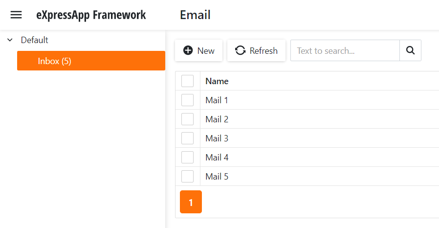

<!-- default badges list -->

<!-- default badges end -->
# XAF - How to show the number of List View items in the Navigation Control

In this example, we demonstrate how to show the number of List View items in the Navigation Control. You can add or delete items in List Views. The record count in navigation item captions will be automatically updated. 

**ASP.NET Core Blazor**

**WinForms**

**ASP.NET Web Forms**

## Implementation Steps

1. Create a View Controller. In the overridden `OnActivated` method, handle the [IObjectSpace.Committed](https://docs.devexpress.com/eXpressAppFramework/DevExpress.ExpressApp.IObjectSpace.Committed) event. In this event handler, call the [ShowNavigationItemController.RecreateNavigationItems](https://docs.devexpress.com/eXpressAppFramework/DevExpress.ExpressApp.SystemModule.ShowNavigationItemController.RecreateNavigationItems) method to re-create the Navigation System items after saving changes made in the current Grid List editor.
2. Create a Window Controller. Handle the [ShowNavigationItemController.NavigationItemCreated](https://docs.devexpress.com/eXpressAppFramework/DevExpress.ExpressApp.SystemModule.ShowNavigationItemController.NavigationItemCreated) event in the overridden `OnFrameAssigned` method. In this event handler, specify the item caption via the `e.NavigationItem.Caption` property.

<!-- default file list --> 
## Files to Review

* [RefreshNavigationController.cs](./ItemCount/Module/CS/ItemCount.Module/Controllers/RefreshNavigationController.cs) 
* [NavigationObjectCountController.cs](./ItemCount/Module/CS/ItemCount.Module/Controllers/NavigationObjectCountController.cs) 
<!-- default file list end -->

## Documentation

- [Access Controller’s Events and Properties](https://docs.devexpress.com/eXpressAppFramework/112676/concepts/controllers-and-actions/customize-controllers-and-actions#access-controllers-events-and-properties)

## More Examples

- [XAF - How to show the number of nested List View items in tab captions](https://github.com/DevExpress-Examples/XAF-How-to-show-the-number-of-nested-list-views-items-in-tab-captions)
<!-- feedback -->
## Does this example address your development requirements/objectives?

 

(you will be redirected to DevExpress.com to submit your response)
<!-- feedback end -->
