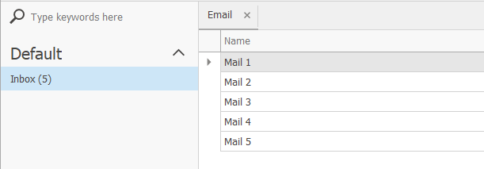
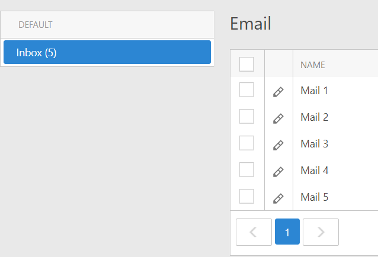

# XAF - How to show the number of List View items in the Navigation Control

## Scenario
In this example, we demonstrate how to show the number of List View items in the Navigation Control. You can add or delete items in List Views. The record count in navigation item captions will be automatically updated.

### WinForms

### ASP.NET Web Forms

## Solution
For implementation details, refer to the following links:
* [RefreshNavigationController.cs](./ItemCount/Module/CS/ItemCount.Module/Controllers/RefreshNavigationController.cs) 
* [NavigationObjectCountController.cs](./ItemCount/Module/CS/ItemCount.Module/Controllers/NavigationObjectCountController.cs) 

